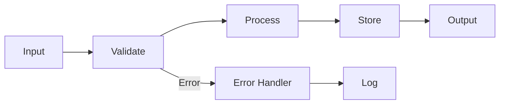

# Поток данных

В этом разделе описан поток данных в системе Oasis 3D.

## Общий поток данных

```
Input → Validation → Processing → Storage → Output
```

## Детальное описание

### 1. Входные данные (Input)

Данные поступают из различных источников:
- Файлы
- API запросы
- База данных
- Потоки данных

### 2. Валидация (Validation)

Проверка корректности данных:
- Проверка типов
- Проверка формата
- Проверка бизнес-правил

### 3. Обработка (Processing)

Основная обработка данных:
- Трансформация
- Агрегация
- Вычисления

### 4. Хранение (Storage)

Сохранение обработанных данных:
- База данных
- Кэш
- Файловая система

### 5. Выходные данные (Output)

Предоставление результатов:
- API ответы
- Файлы
- Уведомления

## Диаграмма потока данных



## Обработка ошибок

Ошибки обрабатываются на каждом этапе:
- Валидация → возврат ошибки валидации
- Обработка → логирование и обработка исключений
- Хранение → транзакции и откат изменений