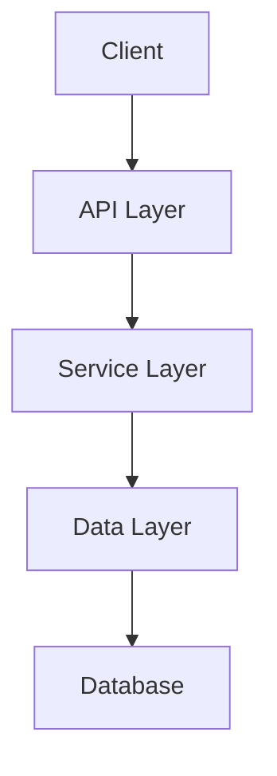

# Архитектура - Обзор

В этом разделе описана архитектура Oasis 3D.

## Общая архитектура

Oasis 3D построен на модульной архитектуре, которая обеспечивает гибкость и расширяемость.

## Основные компоненты

### Core Layer

Основной слой, содержащий базовую функциональность.

### API Layer

Слой API, предоставляющий интерфейсы для взаимодействия.

### Service Layer

Слой сервисов, реализующий бизнес-логику.

### Data Layer

Слой данных, отвечающий за работу с данными.

## Диаграмма архитектуры

## Принципы проектирования

- **Модульность** — система разделена на независимые модули
- **Расширяемость** — легко добавлять новые функции
- **Тестируемость** — каждый компонент можно тестировать отдельно
- **Производительность** — оптимизация критических путей

## Дополнительная информация

- [Design Patterns](design-patterns.md) — Используемые паттерны проектирования
- [Data Flow](data-flow.md) — Поток данных в системе